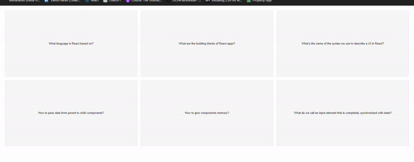

# flashcards
This is a simple application that helps to revise knowledge by using flashcards. At first, flashcards display a question and are presented in grey colour. Then, when a flashcard clicked, it turns red and shows the answer.

This application is bootstrapped with CRA.